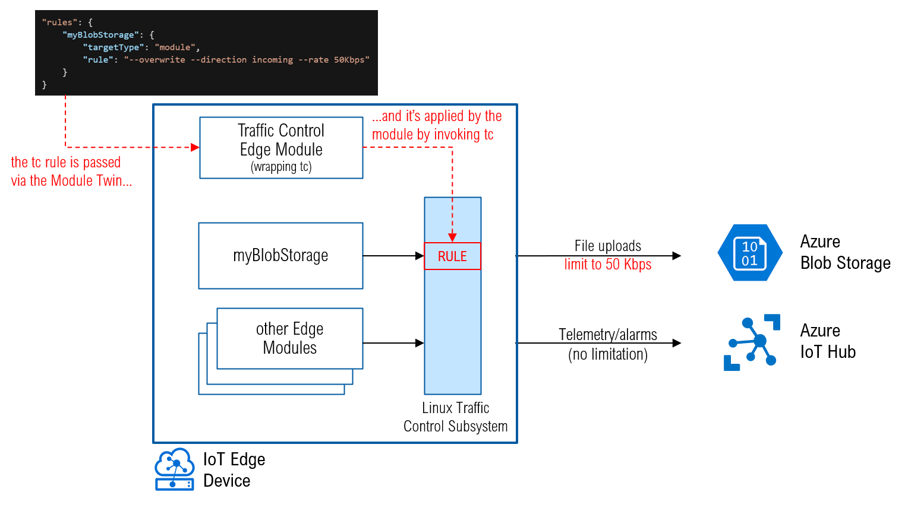
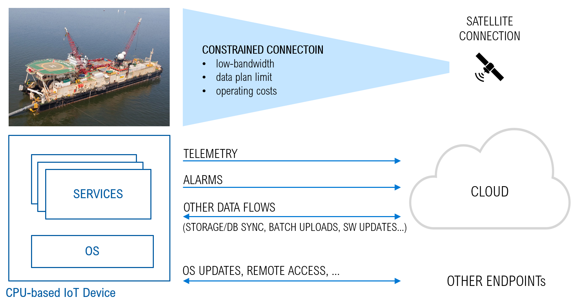
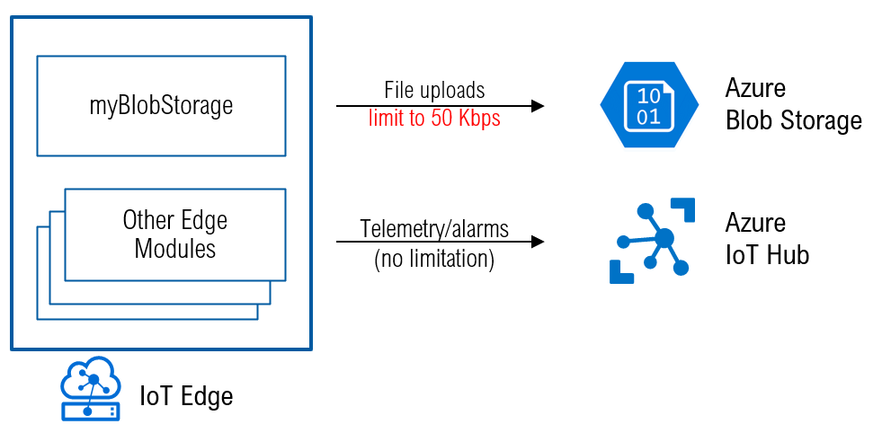
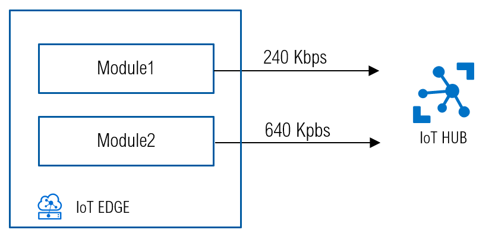

# Bandwidth Shaping in a IoT Edge device
This repo is about the [traffic-control-edge-module](#the-traffic-control-edge-module), an IoT Edge module wrapping the linux kernel's [traffic control subsystem](#linux-traffic-control) to perform bandwidth limitation and traffic shaping within an IoT Edge device.



*DISCLAIMER: This module is provided "as-is", without any guarantee. It is just a proof-of-concept and not meant for production.*

***
* [Why?](#why?)
* [An example](#an-example)
* [Linux Traffic Control: tc and tcset](#linux-traffic-control)
* [The 'traffic-control-edge-module' module](#the-traffic-control-edge-module)
* [Module deployment](#module-deployment)
* [Other examples](#an-example)
* [BMON, a bandwidth monitoring tool](#bmon)

## Why?
Limiting the bandwidth of data-flows is a simple but effective way of prioritizing them, which is key when dealing with IoT Edge devices connected to the IoT HUB over a constrained/metered connection like a SATELLITE connection.



In such a scenario, you may want to limit the bandwidth of **lower priority** data-flows (like file uploads, downloads from repositories or image registries, sync with remote storage/DB), in order to free bandwidth that can be used by **high-priority** streams.

Along with the Priority Queues introduced in IoT Edge v1.0.10 [here](https://techcommunity.microsoft.com/t5/internet-of-things/prioritize-critical-messages-from-your-edge-device-to-the-cloud/ba-p/1777959), this data-flow prioritization strategy can help you to have a better control on your IoT Edge solution.

Have a look to [this](https://techcommunity.microsoft.com/t5/internet-of-things/how-to-deal-with-constrained-metered-connections-when-connecting/ba-p/1758943) blog post for additional context. 

## An example
Let's assume you have a blob storage module (named 'myBlobStorage') running in your IoT Edge device, and you want to make sure it does not exceed  50Kbps when it performs a file transfer.



Here's how to do it:
* [deploy](#module-deployment) the 'traffic-control-edge-module'
* set or update the module twin as usual:
    * go to **Set Modules** 
    * select the traffic control module
    * go to **Module Twin Settings** and enter:
        ```json
        {
            "rules": {
                "myBlobStorage": {
                    "targetType": "module",
                    "rule": "--overwrite --direction incoming --rate 50Kbps"
                }
            }
        }
        ```
    * press **Update**, **Review+create** and finally **create**

That's it. To understand how it works under the cover, keep on reading.

## Linux Traffic Control
How to limit (or shape) the bandwidth of a data-flow?

On a linux system, the kernel's [traffic control subsystem](https://tldp.org/HOWTO/Traffic-Control-HOWTO/intro.html) is an effective and quite versatile way of shaping the bandwidth used by TCP/IP data-flows. 
Such Traffic Control subsystem embeds a packet scheduler and configurable "queueing disciplines" which allow for:
* limiting the bandwidth (with advanced filtering on networks, hosts, ports, directions, ...)
* simulating delays, packet loss, corruption and duplicates (which could be useful to simulate the connectivity's constraints and validate the solution)

The **Traffic Control utility**, aka **'tc'**, is a command-line tool that gives you full access to the kernel packet scheduler. It is pre-installed in many distros (ex. Ubuntu) or you can easily install it if missing. In case of Debian for instance:
```
sudo apt-get install iproute2
```

You can the start experimenting with tc in a shell and start creating and applying rules to limit the bandwidth of a service, or to simulate packet loss/corruption and network delays (which can be btw very interesting for investigate further the implications of a constrained connection on application's performance and reliability). 
For instance the following will limit the egress bandwidth of the network interface 'eth0' to 1Mbps:
```
tc qdisc add dev eth0 root tbf rate 1mbit burst 32kbit
```
Some examples [here](https://netbeez.net/blog/how-to-use-the-linux-traffic-control/).

If you want to interact with tc in a even easier way, try [tcset](https://tcconfig.readthedocs.io/en/latest/pages/usage/tcset/index.html#tcset-command-help). It's a 'tc' wrapper developed in python, with a simpler syntax. This is how a bandwidth limitation rule looks like with tcset:
```
tcset eth0 --rate 100Kbps
```

With a device running Linux, you could remotely SSH onto it and use command lines to configure tc, but that's not a scalable method if you are dealing with many devices in a production environment. 

If you are using Azure IoT Edge for edge compute, we have created an open-source module that will help you. With this module, you will be able to configure traffic control through the module twin like you would for any other IoT Edge modules.


***

## The traffic-control-edge-module
The **traffic-control-edge-module** is a sample IoT Edge module wrapping the [tcset](https://tcconfig.readthedocs.io/en/latest/pages/usage/tcset/index.html#tcset-command-help) command-line tool to perform bandwidth limitation and traffic shaping within an IoT Edge device via Module Twins.

Tcset rules are set as desired properties (*properties.desired.rules*) in the **traffic-control-edge-module** twin, and applied by the module at runtime by invoking tcset. 

The **traffic-control-edge-module** also embeds a docker client listening to the containers lifecycle events, and a simple logic to apply (or refresh) the rules when a container is started (or re-started).

The Module Twin path *properties.desired.rules* is a nested object where each node of the object maps a tcset rule:

```csharp
"properties.desired.rules": {
    "<targetName>": { //either a module/container name or network adapter name
        "targetType": <targetType> //can be a 'module' or 'if'
        "rule": <rule> //the tc-config rule string to be applied
    },
    ...
}
```
where:

* `<targetName>`: the name of the target for the rule
    * either a iot edge module name (ex. 'Module1', 'myBlobModule', ...)
    * or a network interface name (ex. 'eth0' or 'docker0' or 'VETHxxx')

* `<targetType>`: the type of the target for the rule
    * 'module' for a iot edge module or container
    * 'if' for a network interface

* `<rule>` is the tcset rule string to be applied

Why the `<targetType>` does matter? Traffic Control rules can be applied only to virtual or physical network adapters. Then:
* if `<targetType>`='if', the `<targetName>` is expected to be a network adapter name (like 'eth0', 'docker0', 'veth...') and the rule can be applied directly (provided that such adapter exists).
* if `<targetType>`='module', the `<targetName>` is expected to be the name of a iot edge module (i.e. container). In that case, the first thing to do is retrieving the name of the virtual adapter attached to such container. Such adapter has usually a name like 'veth...' (example 'veth4ee5228'). The method `_getVethName()` in `tc/wrapper.py` takes care of that.

Going back to the [example](#an-example) of the "myBlobStorage" bandwidth limited to 50Kbps, here what happens under the cover:


As soon as the 'traffic-control-edge-module' instance running on the IoT Edge receives the twin update, it extracts the "myBlobStorage" rule and applies it by invoking tcset.

## Module deployment
To deploy the `traffic-control-edge-module` through the Azure portal:

* in the Azure portal, navigate to your IoT HUB
* go to **IoT Edge** and select your IoT Edge device
* select **Set Modules**
* in the **Modules** section of the page, click **Add** then select **IoT Edge Module**
* enter any **Name** for the module
* in the **Module Settings** section, enter the following **Image URI**:

        arlotito/traffic-control-edge-module:0.0.1-amd64

* in the **Container Create Options** section, enter:
    
    NOTE: replace `<moduleName>` with your module name

    ```json
    {
        "NetworkingConfig": {
            "EndpointsConfig": {
                "host": {}
            }
        },
        "HostConfig": {
            "Binds": [
                "/var/run/docker.sock:/var/run/docker.sock:ro",
                "/sys/devices/virtual/net/:/<moduleName>/sys/devices/virtual/net/"
            ],
            "NetworkMode": "host",
            "CapAdd": [
                "NET_ADMIN"
            ]
        }
    }
    ```

     **WARNING**: *this module requires read-only access to the docker socket (`/var/run/docker.sock`) in order to listen to the docker engine's lifecycle events. Be aware that this could expose to security risks, including an unauthorized root access to the host.*
    

* in the **Module Twin Settings**, enter your traffic control rules as follows:

    ```
    {
        "rules": {
            "<targetName>": {
                "targetType": "<targetType>",
                "rule": "<rule>"
            },
            ...
        }
    }
    ```
* click on **Add**
* click **Review+Create** and **Create**

Once the module is running in the IoT Edge device, you can use it to apply the desired traffic control rules using its Module Twin.

## Another example
Let's assume you have an IoT Edge device running two IoT Edge modules (`Module1` and `Module2`), and you want to limit the bandwidth to 240Kpbs and 640Kbps. 



Here's how to do it:
* [deploy](#module-deployment) the traffic control module
* set or update the module twin as usual:
    * go to **Set Modules**
    * select the traffic control module
    * go to **Module Twin Settings** and enter:
        ```json
        {
            "rules": {
                "Module1": {
                    "targetType": "module",
                    "rule": "--overwrite --direction incoming --rate 240Kbps"
                },
                "Module2": {
                    "targetType": "module",
                    "rule": "--overwrite --direction incoming --rate 640Kbps"
                }
            }
        }
        ```
    * press **Update**
    * press **Review+create** and finally **create**

***

## BMON
To monitor and validate the bandwidth limitations, you'll need a bandwidth monitoring tool like [bmon](#bmon).

[bmon](https://github.com/tgraf/bmon) is a simple yet powerful, text-based network monitoring and debugging tool for Unix-like systems, which captures networking related statistics and displays them visually in a human friendly format. It is a reliable and effective real-time bandwidth monitor and rate estimator.
Install it using the packet manager:
```
$ sudo yum install bmon      [On RHEL/CentOS/Fedora]
$ sudo dnf install bmon      [On Fedora 22+]
$ sudo apt-get install bmon  [On Debian/Ubuntu/Mint]
```
or building it from source: https://github.com/tgraf/bmon

